# Hello Agent 学习笔记

本项目记录 AI 智能体（Agent）从零学习与实战过程，涵盖环境搭建、Git 版本管理、ReAct 核心范式实现及工具动态调用。

---

## 一、预备工作

### 1. Git 初始化与远程关联

| 步骤 | 操作 | 对应命令 | 说明 |
| :---: | :--- | :--- | :--- |
| **01** | 创建并进入目录 | `mkdir demo && cd demo` | 准备工作目录 |
| **02** | 初始化 Git 仓库 | `git init` | 本地生成 `.git` 管理目录 |
| **03** | 编写忽略文件 | 新建并编辑 `.gitignore` | 必须在 `add` 前完成，忽略 `.venv/` 与 `.env` |
| **04** | 暂存所有修改 | `git add .` | 将工作区变动提交到暂存区 |
| **05** | 提交本地快照 | `git commit -m "feat: initial commit"` | 形成第一个本地版本快照 |
| **06** | 远端创建仓库 | 在 GitHub 点击 New repository | ⚠️ 保持空仓库，不要勾选生成 README |
| **07** | 规范主分支名 | `git branch -M main` | 统一分支名为 `main`，与 GitHub 保持一致 |
| **08** | 关联远端仓库 | `git remote add origin <URL>` | 建立本地与 GitHub 仓库的远程映射通道 |
| **09** | 首次推送绑定 | `git push -u origin main` | 首次带 `-u` 绑定上游分支，后续仅需 `git push` |

> 📌 **Git 撤销备忘**：若误把 `.venv` 放入了暂存区，可执行 `git restore --staged .venv` 撤回暂存（保留本地物理文件）。

---

### 2. Python 虚拟环境与依赖管理

```powershell
# 1. 创建虚拟环境
python -m venv .venv

# 2. 激活虚拟环境 (Windows PowerShell / CMD)
.venv\Scripts\activate

# 3. 安装项目依赖
pip install python-dotenv requests openai tavily-python

# 4. 退出虚拟环境
deactivate
```

---

## 二、第一章：Agent 基础（智能旅行助手）

### 1. 目录结构

```text
hello-agent-learn/
├── .env                  # 本地真实环境变量（已加入 .gitignore，防泄密）
├── .env.example          # 环境变量示例模板（提交至 Git 供参考）
├── .gitignore            # Git 忽略配置
├── readme.md             # 项目学习笔记
└── Chapter01/
    ├── main.py           # 主入口：装配组件并驱动 ReAct 循环
    ├── llm/
    │   └── llm.py        # 大模型客户端（兼容 OpenAI 协议）
    ├── prompts/
    │   └── system_prompts.md  # 系统提示词（Prompt 模板）
    └── tools/
        └── tools_register.py  # 工具定义与注册表（实时天气与景点搜索）
```

---

### 2. 环境变量配置 (.env)

克隆项目后，首先在项目根目录下通过模板复制 `.env`：

```powershell
copy .env.example .env
```

在生成的 `.env` 文件中填入实际凭据：

```ini
# 大模型配置（支持 DeepSeek / 商汤 / OpenAI 等兼容接口）
OPENAI_API_KEY="你的API_KEY"
OPENAI_BASE_URL="https://token.sensenova.cn/v1"   # ⚠️ 注意：末尾无需 /chat/completions
MODEL_ID="deepseek-v4.1-flash"

# 外部工具配置（Tavily 搜索）
TAVILY_API_KEY="你的Tavily_KEY"
```

> 💡 **Tavily API Key 获取方式**：
> 1. 前往官网 [tavily.com](https://tavily.com/)（支持使用 GitHub 账号一键授权登录）；
> 2. 在控制台 Dashboard 首页直接复制生成的 API Key（格式为 `tvly-xxxxxx`，每月提供 1000 次免费调用）；
> 3. 将其填入 `.env` 中的 `TAVILY_API_KEY`，Agent 即可联网搜索真实景点信息。

---

### 3. 核心模块与代码逻辑

- **`prompts/system_prompts.md`**  
  纯文本定义智能旅行助手角色、输出规范（严格遵循 `Thought:` 与 `Action:` 成对输出）及任务结束指令 `Finish[最终答案]`。

- **`tools/tools_register.py`**  
  - `get_weather(city)`：调用 `wttr.in` 查询指定城市实时天气。
  - `get_attraction(city, weather)`：调用 `TavilyClient` 联网搜索匹配天气的旅游景点。
  - `available_tools`：统一工具字典映射，供主循环根据模型输出的函数名动态反射调用。

- **`llm/llm.py`**  
  基于官方 `openai` SDK 封装 `OpenAICompatibleClient`，实现统一的大模型服务调用。

- **`main.py`**  
  核心调度中心，启动 ReAct 闭环循环（最多 5 轮迭代）：
  
  ```text
  用户输入 ──> 大模型思考 (Thought) ──> 工具调用 (Action) ──> 观察环境 (Observation) ──> 任务结束 (Finish)
  ```

---

### 4. 运行测试

```powershell
python Chapter01/main.py
```


## 三、第二、三章：大模型基本原理

> 📌 本章总结了大语言模型（LLM）的底层运行机制、架构演进与核心概念（结合相关资料与个人理解）。

---

### 1. 模型演进与核心架构

#### (1) 语言模型演进历程
大语言模型的核心任务是：**根据已有内容预测下一个 Token**。

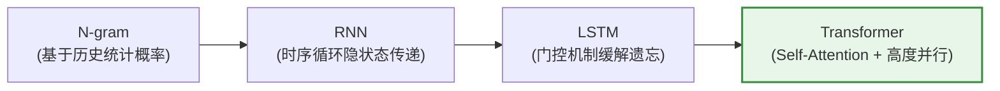

| 模型架构 | 核心机制 | 核心优势 | 主要局限 / 痛点 |
| :--- | :--- | :--- | :--- |
| **N-gram** | 统计前 $N$ 个词出现的联合概率 | 原理直接，无需神经网络训练 | 只能依赖很短的历史窗口，缺乏真正的语义理解能力 |
| **RNN** | 将前面时刻的信息状态依次循环向下传递 | 理论上可传递全局时序上下文 | 1. 序列过长容易遗忘早期信息（梯度消失/爆炸）<br>2. 必须串行计算，无法充分利用 GPU 并行加速 |
| **LSTM** | 引入门控机制（输入门/遗忘门/输出门） | 缓解了基础 RNN 的长程遗忘问题 | 计算结构更复杂，依然受限于时序串行依赖瓶颈 |
| **Transformer** | 彻底摒弃循环，依赖 **Attention（注意力机制）** | 1. 支持全局关联与长距离依赖<br>2. 支持 GPU 高度并行计算，催生超大规模模型 | 对极长上下文显存消耗高（$O(N^2)$ 计算复杂度） |

---

#### (2) Transformer 核心机制

- **Self-Attention（自注意力机制）**：让当前 Token 动态计算并重点关注上下文中最相关的 Token。
  - **Q (Query)**：*“我现在想找什么信息？”*（发起检索的主体）
  - **K (Key)**：*“我这里有什么特征标签可供匹配？”*（供匹配的标签）
  - **V (Value)**：*“如果匹配成功，我能提供的实际信息是什么？”*（内容载体）

> 💡 **示例：指代消歧（谁很饿？）**  
> **例句**：“小明把苹果给了小红，因为**她**很饿。”

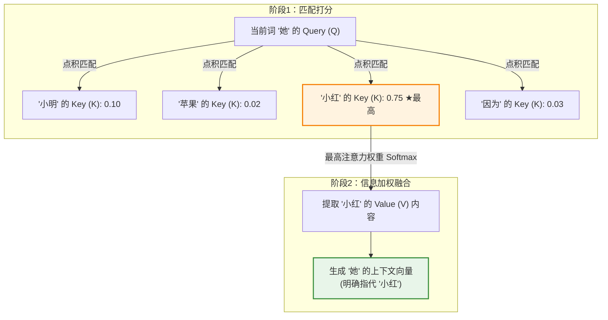

- **Multi-Head Attention（多头注意力机制）**：  
  不局限于单一视角，而是并行运行多个独立的注意力“头”。例如：
  - **Head 1**：关注实体间的代词指代与人际关系；
  - **Head 2**：关注句式的主谓宾语法结构；
  - **Head 3**：关注上下文中的因果与推导关系。

- **FFN（前馈神经网络）**：  
  - **Attention** 负责在 Token 之间**收集与搬运上下文信息**；
  - **FFN** 负责对收集到的信息做**非线性变换与深度加工**。

---

#### (3) Decoder-Only 架构与因果掩码 (Causal Mask)

目前主流的 GPT 系列模型均基于 **Decoder-Only Transformer** 架构构建，通过单向注意力（因果掩码）确保模型无法提前“偷看”未来的内容：

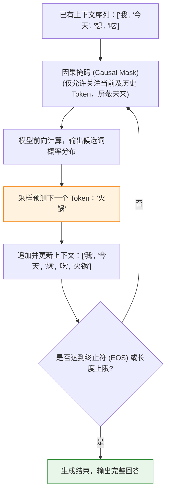

---

### 2. 文本生成全流程

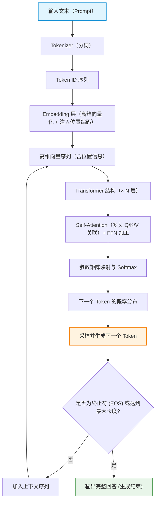

---

### 3. 核心概念与关键技术

#### (1) 文本分词 (Tokenization)
自然语言无法直接输入神经网络，需先通过分词器（Tokenizer）将文本切分成最小语义单元（Token），并映射为词表索引（Token ID）：

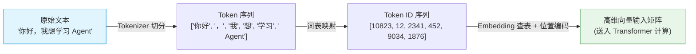

---

#### (2) 提示词工程 (Prompt Engineering)
Prompt 是将任务意图、规则规范和背景上下文传递给大模型的媒介。

| 维度 | 基础 Prompt（效果欠佳） | 优化后 Prompt（推荐规范） |
| :--- | :--- | :--- |
| **示例** | `帮我查天气` | 你是一个天气助手。<br>请根据用户提供的城市，调用天气工具获取实时天气。<br>如果用户未提供城市，请主动询问，禁止编造虚假天气信息。 |
| **特点** | 缺少角色约束、边界模糊，模型容易自由发散或产生幻觉 | 明确角色设定、输入要求、调用工具条件与负向限制规则 |

在 Agent 开发中，常见的 Prompt 类别包括：
- **System Prompt**：定义 Agent 的全局人设、运行原则与可用工具列表。
- **Tool / ReAct Prompt**：规范模型执行“思考（Thought）- 行动（Action）- 观察（Observation）”的推理循环格式。
- **RAG Prompt**：注入检索召回的外部私有知识，限制模型严格“根据参考资料回答”。

---

#### (3) 模型调用与关键超参数

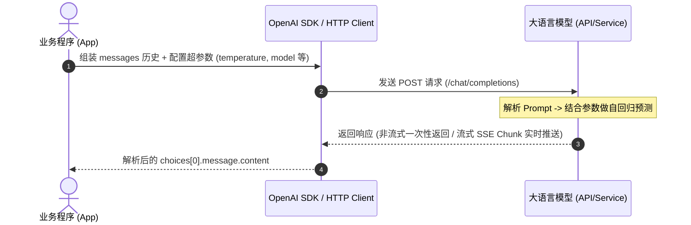

常见控制模型行为的核心超参数：

| 参数名 | 类型 | 说明与调节经验 |
| :--- | :--- | :--- |
| `model` | `string` | 指定调用的模型名称（如 `deepseek-chat`, `gpt-4o` 等） |
| `temperature` | `float` | **温度系数**（0 ~ 2）：数值越低，回答越严谨、确定；数值越高，回答越多样、具创造性。Agent 结构化输出或工具调用通常建议调低（如 `0.1 ~ 0.3`） |
| `top_p` | `float` | **核采样（Nucleus Sampling）**：在累积概率达到 $P$ 的候选 Token 集合中采样，通常与 `temperature` 二选一调节 |
| `max_tokens` | `integer` | 限制单次回答生成的最大 Token 数量，避免无限生成或控制消耗 |
| `messages` | `list[dict]` | 会话历史消息列表，遵循 `role`（`system` / `user` / `assistant` / `tool`）与 `content` 结构 |

---

#### (4) 模型幻觉 (Hallucination)
- **现象**：模型以十分确定和流畅的语气，输出事实错误、无中生有或自相矛盾的内容。
- **诱因**：模型本质是概率分布预测器，并非检索式知识库；缺少实时世界状态与专有领域知识。
- **应对方案**：

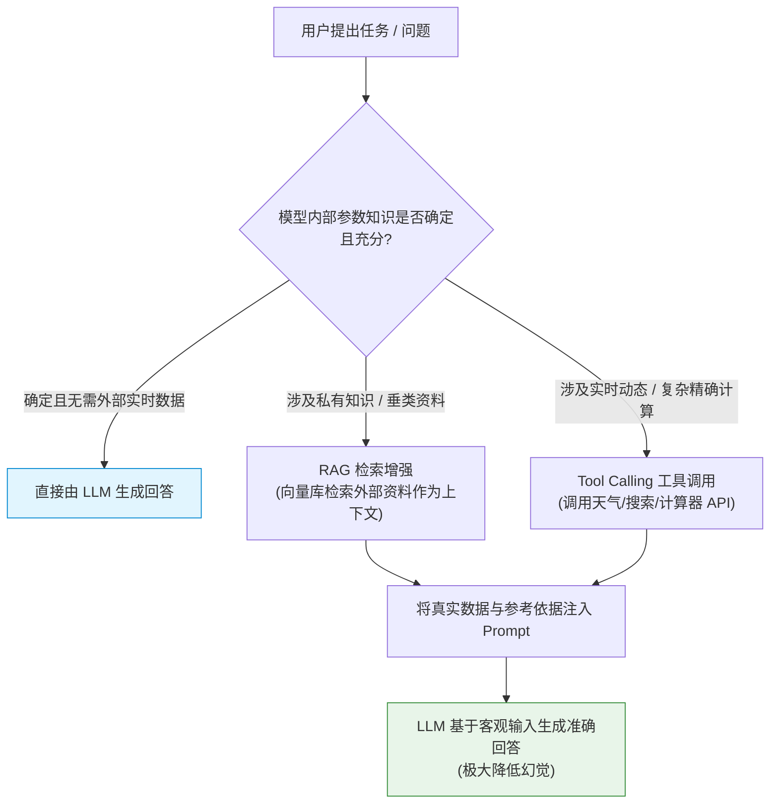

---

### 4. 本章小结

大语言模型（LLM）本质是一个**基于 Transformer 架构的自回归“下一个 Token 预测器”**：
1. **输入与上下文**：通过 **Prompt Engineering** 和 **Tokenization** 为其提供精准的任务目标与输入向量；
2. **生成控制**：通过 **Temperature / Top-P** 等采样参数调节生成的确定性与创造性；
3. **能力补全**：通过 **RAG（知识增强）** 与 **Tool Calling（工具调用）** 弥补知识时效性与计算短板，抑制模型幻觉；
4. **进阶落地**：将上述能力整合并驱动 ReAct 循环，便构成了具备感知、规划与执行能力的 **AI Agent**。

---

## 四、第四章：大模型 Agent 技术架构

> 📌 本章围绕 Agent 核心技术架构展开，深入剖析 **ReAct（推理 + 行动）**、**Plan-and-Solve（计划后执行）** 与 **Reflection（反思自纠）** 三大主流范式，并从零实现一个工业级模块化的 ReAct 智能体。

---

### 4.1. Agent 核心设计范式对比

大模型驱动的智能体通常采用以下三种主流技术范式：

| 范式名称 | 核心理念 | 运行机制 | 适用典型场景 |
| :--- | :--- | :--- | :--- |
| **ReAct** (Reason + Act) | **边思考、边执行、边调整** | “思考 (Thought) $\to$ 行动 (Action) $\to$ 观察 (Observation)” 循环迭代 | 需动态交互、实时检索、多步工具调用的任务 |
| **Plan-and-Solve** | **先全盘规划，再逐步执行** | 阶段一：全局任务分解生成执行计划清单；<br>阶段二：按步骤依序逐一执行每个子任务 | 任务目标明确、步骤长但分支依赖可预期的复杂任务 |
| **Reflection** | **自我反思、批判纠错** | “生成初代答案 $\to$ 评估反思不足 $\to$ 自我修正优化” 闭环 | 代码编写与审查、长文写作、逻辑证明优化 |

---

### 4.2. ReAct 范式深度解析

#### 4.2.1 基础概念

(1) 从思维链 (CoT) 到 ReAct
- **思维链 (Chain-of-Thought)**：引导模型展示推理步骤，但只能基于参数记忆，**无法与外部环境交互**，容易产生事实性幻觉；
- **ReAct**（由 Shunyu Yao 于 2022 年提出）：将**推理（Reasoning）**与**行动（Acting）**深度结合：
  - 推理使行动更具目的性；
  - 行动为推理提供外部客观事实支撑。

#### 4.2.2 ReAct 闭环核心三要素

```text
Thought (内心独白) ──> Action (调用工具) ──> Observation (获取结果) ──> 追加历史 ──> 循环迭代
```

- **Thought（思考）**：智能体的推理与自我规划。分析当前上下文、拆解任务目标、推导下一步应采取的动作。
- **Action（行动）**：决定执行的具体操作，通常是调用外部工具，格式如 `Search['哈尔滨今天天气']` 或终结指令 `Finish[最终答案]`。
- **Observation（观察）**：执行工具后由外部环境返回的客观结果（如搜索摘要、API 响应）。

#### 4.2.3 ReAct 完整执行生命周期


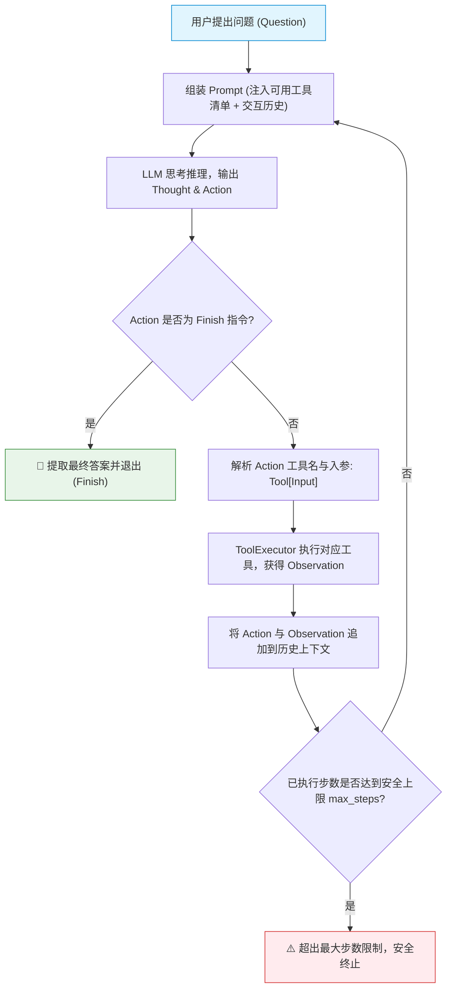

---

#### 4.2.4 模块化工程实现

本章代码采用解耦的模块化结构实现，目录组织如下：

```text
Chapter04/
├── HelloAgent.py             # 统一 LLM 客户端（支持兼容 OpenAI 接口与流式响应）
├── tool_executor.py          # 工具注册与调度执行器 (ToolExecutor)
├── tools/                    # 独立工具包
│   ├── __init__.py           # 工具统一收口与导出
│   └── search_tool.py        # 基于 SerpApi 的智能搜索工具
├── prompts/                  # 提示词模块
│   ├── __init__.py           # ReAct 提示词模板导出
│   └── system_prompts.md     # 提示词纯文本备份
├── test_tools.py             # 工具单测与执行验证
└── ReActAgent.py             # ReAct 闭环智能体核心驱动类
```

---

#### 4.2.5 LLM 客户端封装 ([Chapter04/HelloAgent.py](Chapter04/HelloAgent.py))
封装 `HelloAgentsLLM` 类，通过读取环境变量实现大模型接口的统一配置与流式响应（Stream），支持 DeepSeek、阿里云通义、商汤日日新等任意 OpenAI 兼容服务。

---

#### 4.2.6 工具定义与通用执行器

一个合格的 Agent 工具必须包含**三核心要素**：
1. **名称 (Name)**：唯一标识符（如 `Search`）；
2. **描述 (Description)**：清楚阐明**何时应该使用该工具**（大模型依赖此描述进行工具决策）；
3. **执行函数 (Execution Logic)**：真正执行底层网络请求或计算的代码。

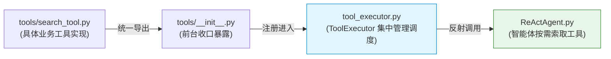

- **搜索工具**（[Chapter04/tools/search_tool.py](Chapter04/tools/search_tool.py)）：  
  接入 SerpApi 网页检索，并实现**智能降级解析**（优先返回直接答案框 `answer_box` 与知识图谱 `knowledge_graph`，无直接答案时降级返回前 3 条自然搜索结果摘要）。
- **执行调度器**（[Chapter04/tool_executor.py](Chapter04/tool_executor.py)）：  
  提供 `register_tool`、`get_tool` 与 `get_available_tools` 接口，解耦工具定义与智能体主体。

---

#### 4.2.7 提示词模板设计 ([Chapter04/prompts/__init__.py](Chapter04/prompts/__init__.py))

模板强制约束了模型输出的语法协议，确保能够被正则可靠解析：
- **角色定位**：设定智能助手人设；
- **可用工具 ({tools})**：动态注入所有已注册工具的名称与使用场景说明；
- **输出格式规约**：必须严格遵循 `Thought:` 与 `Action:` 结构；
- **历史上下文 ({history})**：持续累积历史的 Action 和 Observation，形成递增思考链条。

---

#### 4.2.8 ReActAgent 核心驱动逻辑 ([Chapter04/ReActAgent.py](Chapter04/ReActAgent.py))

智能体由以下几个关键机制构成闭环：
1. **主循环 (`run`)**：以 `max_steps` 作为安全保护锁，控制最大推理深度；
2. **正则解析器 (`_parse_output` & `_parse_action`)**：将模型返回的纯文本拆解为 `Thought` 与 `Action`，并从 `ToolName[Input]` 结构中抽取出参数；
3. **工具反射与调用**：通过 `tool_executor.get_tool(tool_name)` 动态反射调用 Python 函数；
4. **历史记忆更新**：将每一轮的 Action 与 Observation 追加到 `self.history`。

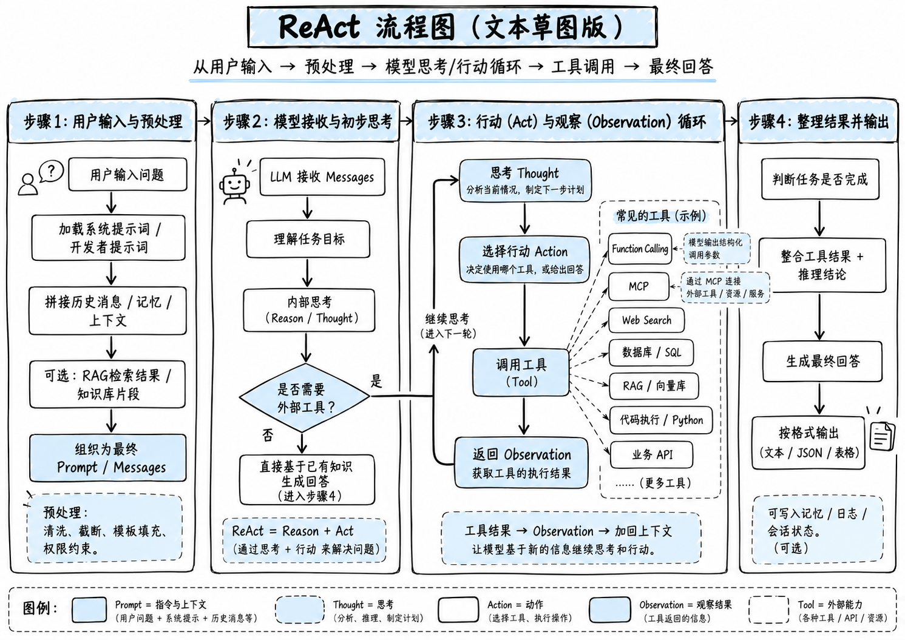

---

#### 4.2.9 运行实例与日志分析

在终端执行 ReActAgent 查询实时天气：

```powershell
python Chapter04/ReActAgent.py
```

#### 完整终端执行日志：

```text
工具 'Search' 已注册。
🚀 开始解决问题: 今天哈尔滨天气如何？

--- 第 1 步 ---
🧠 正在调用 deepseek-v4.1-flash 模型...
✅ 大语言模型响应成功:
Thought: 用户想知道今天哈尔滨的天气情况，这需要获取实时天气信息，我会使用网页搜索工具查询。  
Action: Search[哈尔滨今天天气]

思考: 用户想知道今天哈尔滨的天气情况，这需要获取实时天气信息，我会使用网页搜索工具查询。
🎬 行动: Search[哈尔滨今天天气]
🔍 正在执行 [SerpApi] 网页搜索: 哈尔滨今天天气
👀 观察: [1] 28日（今天）
28日（今天）. 多云转晴. 19/9℃. <3级 · 29日（明天）. 小雨转多云. 17/4℃. 3-4级转<3级 · 30日（后天）. 多云转阵雨. 14/4℃. 3-4级转<3级 · 1日（周四）. 小雨转晴. 12/5℃. 3 ... 

[2] 黑龙江 - 中国气象局-天气预报-城市预报
时间, 08:00, 11:00 ; 天气 ; 气温, 14.1℃, 15.9℃ ; 降水, 无降水, 无降水 ; 风速, 3.3m/s, 7.9m/s ...

[3] 哈尔滨-天气预报
11:00 · 15.2℃. 7.9m/s. 南风. 995.7hPa ; 14:00 · 16.8℃. 7m/s. 南风. 993.8hPa ; 17:00 · 14.8℃. 4.6m/s. 西南风. 993.7hPa.

--- 第 2 步 ---
🧠 正在调用 deepseek-v4.1-flash 模型...
✅ 大语言模型响应成功:
Thought: 已获得哈尔滨今天的天气信息，可以直接回答。
Action: Finish[今天哈尔滨天气为多云转晴，气温约 19/9℃，风力小于3级。白天部分时段气温在 15℃ 左右，午后最高约 16.8℃，吹南风或西南风。]

思考: 已获得哈尔滨今天的天气信息，可以直接回答。
🎉 最终答案: 今天哈尔滨天气为多云转晴，气温约 19/9℃，风力小于3级。白天部分时段气温在 15℃ 左右，午后最高约 16.8℃，吹南风或西南风。
```

> 🎯 **运行过程分析**：
> - **第 1 轮**：模型判断自身缺乏当天的实时天气数据，触发推理决策（Thought），决定调用 `Search[哈尔滨今天天气]`（Action）；
> - **环境反馈**：SerpApi 返回哈尔滨的客观天气预报并注入记忆上下文（Observation）；
> - **第 2 轮**：模型在包含了最新天气的完整上下文中推理，认为信息充分，果断输出 `Finish[...]` 给出最终答案，完成闭环！

#### 4.2.10 ReAct 小结

**特点：**
1. **透明**：可以直观的看到Agent的执行过程。
2. **动态规划和纠错**：可以根据工具执行结果动态调整后续的 Thought 和 Action。如果上一步的搜索结果不理想，它可以在下一步中修正搜索词，重新尝试。
3. **通用性强**：通过将工具封装，可以轻松的为Agent添加新的功能。
4. **协同工作**：LLM 负责运筹帷幄（规划和推理），工具负责解决具体问题（搜索、计算），二者协同工作，解决了单一 LLM 在知识时效性、计算准确性等方面的固有局限。

**局限性：**
1. ReAct 流程的成功与否，高度依赖于底层 LLM 的综合能力。
2. 完成一个任务通常需要多次调用 LLM。每一次调用都伴随着网络延迟和计算成本。对于需要很多步骤的复杂任务，这种串行的“思考-行动”循环可能会导致较高的总耗时和费用。
3. **提示词的脆弱性**：整个机制的稳定运行建立在一个精心设计的提示词模板之上。模板中的任何微小变动，甚至是用词的差异，都可能影响 LLM 的行为。此外，并非所有模型都能持续稳定地遵循预设的格式，这增加了在实际应用中的不确定性。
4. **规划与搜索的解耦**：可能陷入局部最优：步进式的决策模式意味着智能体缺乏一个全局的、长远的规划。它可能会因为眼前的 Observation 而选择一个看似正确但长远来看并非最优的路径，甚至在某些情况下陷入“原地打转”的循环中。

**调试方法：**  
当你构建的 ReAct 智能体行为不符合预期时，可以从以下几个方面入手进行调试：
1. **检查完整的提示词**：在每次调用 LLM 之前，将最终格式化好的、包含所有历史记录的完整提示词打印出来。这是追溯 LLM 决策源头的最直接方式。
2. **分析原始输出**：当输出解析失败时（例如，正则表达式没有匹配到 Action），务必将 LLM 返回的原始、未经处理的文本打印出来。这能帮助你判断是 LLM 没有遵循格式，还是你的解析逻辑有误。
3. **验证工具的输入与输出**：检查智能体生成的 tool_input 是否是工具函数所期望的格式，同时也要确保工具返回的 observation 格式是智能体可以理解和处理的。
4. **调整提示词中的示例 (Few-shot Prompting)**：如果模型频繁出错，可以在提示词中加入一两个完整的“Thought-Action-Observation”成功案例，通过示例来引导模型更好地遵循你的指令。
5. **尝试不同的模型或参数**：更换一个能力更强的模型，或者调整 temperature 参数（通常设为0以保证输出的确定性），有时能直接解决问题。

---

### 4.3 Plan-and-Solve (计划后执行) 详解

先规划 (Plan)，后执行 (Solve)。适用于那些结构性强、可以被清晰分解的复杂任务。

- **多步数学应用题**：需要先列出计算步骤，再逐一求解。
- **需要整合多个信息源的报告撰写**：需要先规划好报告结构（引言、数据来源A、数据来源B、总结），再逐一填充内容。
- **代码生成任务**：需要先构思好函数、类和模块的结构，再逐一实现。

#### 4.3.1 原理
解决思维链在处理多步骤、复杂问题时容易“偏离轨道”的问题。与 ReAct 将思考和行动融合在每一步不同，Plan-and-Solve 将整个流程解耦为两个核心阶段：
- **规划阶段 (Planning Phase)**：Agent接受用户输入发给大模型将用户问题分解，并制定出一个清晰、分步骤的行动计划。
- **执行阶段 (Solving Phase)**：Agent严格按照计划中的步骤，逐一执行。每一步的执行都可能是一次独立的 LLM 调用，或者是对上一步结果的加工处理，直到计划中的所有步骤都完成，最终得出答案。（无依赖关系的子任务/步骤可以并行处理，从而提高效率。有依赖关系的子任务/步骤需要串行处理。）

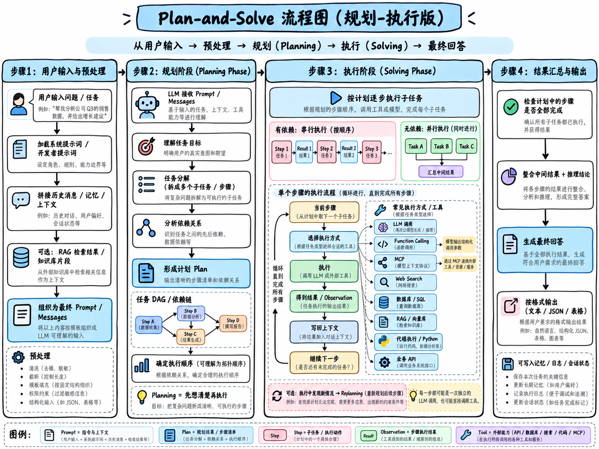

#### 4.3.2 工程实现与运行
不使用工具的方式，而是通过提示词的设计，完成一个推理任务。答案无法通过单次查询或计算得出，必须先将问题分解为一系列逻辑连贯的子步骤，然后按顺序求解。发挥 Plan-and-Solve “先规划，后执行”的核心能力。

##### 1. 规划提示词
`Chapter04\prompts\__init__.py` 中的 `PLANNER_PROMPT_TEMPLATE`：
- **角色设定**：“顶级的AI规划专家”，激发模型的专业能力。
- **任务描述**：清晰地定义了“分解问题”的目标。
- **格式约束**：强制要求输出为一个 Python 列表格式的字符串，这极大地简化了后续代码的解析工作，使其比解析自然语言更稳定、更可靠。

将这个提示词逻辑封装成一个 Planner 类，这个类也是我们的规划器：  
`Chapter04\Planner.py`

在规划器 (Planner) 生成计划后，需要一个执行器 (Executor) 来逐一完成计划中的任务。执行器负责调用大语言模型来解决每个子问题，还需要状态管理。它必须记录每一步的执行结果，并将其作为上下文提供给后续步骤，确保信息在整个任务链条中顺畅流动。

在已有上下文的基础上，专注解决当前这一个步骤。因此，步骤执行提示词需要包含以下关键信息：
- **原始问题**：确保模型始终了解最终目标。
- **完整计划**：让模型了解当前步骤在整个任务中的位置。
- **历史步骤与结果**：提供至今为止已经完成的工作，作为当前步骤的直接输入。
- **当前步骤**：明确指示模型现在需要解决哪一个具体任务。

`Chapter04\Executor.py`

现在已经分别构建了负责“规划”的 Planner 和负责“执行”的 Executor。最后一步是将这两个组件整合到一个统一的智能体 PlanAndSolveAgent 中，并赋予它解决问题的完整能力。我们将创建一个主类 PlanAndSolveAgent，它的职责非常清晰：接收一个 LLM 客户端，初始化内部的规划器和执行器，并提供一个简单的 run 方法来启动整个流程：  
`Chapter04\PlanAndSolveAgent.py`

##### 2. 最后测试效果
在终端运行：
```powershell
python Chapter04\test_plan_and_solve.py
```
可以看到日志：

````text
--- 开始处理问题 ---
问题: 一个水果店周一卖出了15个苹果。周二卖出的苹果数量是周一的两倍。周三卖出的数量比周二少了5个。请问这三天总共卖出了多少个苹果？
--- 正在生成计划 ---
🧠 正在调用 xxxx 模型...
✅ 大语言模型响应成功:
```python
["计算周一卖出的苹果数量： 15个", "计算周二卖出的苹果数量： 周一数量 × 2 = 15 × 2 = 30个", "计算周三卖出的苹果数量： 周二数量 - 5 = 30 - 5 = 25个", "计算三天总销量： 周一 + 周二 + 周三 = 15 + 30 + 25 = 70个"]
```
✅ 计划已生成:
```python
["计算周一卖出的苹果数量： 15个", "计算周二卖出的苹果数量： 周一数量 × 2 = 15 × 2 = 30个", "计算周三卖出的苹果数量： 周二数量 - 5 = 30 - 5 = 25个", "计算三天总销量： 周一 + 周二 + 周三 = 15 + 30 + 25 = 70个"]
```

--- 正在执行计划 ---

-> 正在执行步骤 1/4: 计算周一卖出的苹果数量: 15个
🧠 正在调用 xxxx 模型...
✅ 大语言模型响应成功:
15
✅ 步骤 1 已完成，结果: 15

-> 正在执行步骤 2/4: 计算周二卖出的苹果数量: 周一数量 × 2 = 15 × 2 = 30个
🧠 正在调用 xxxx 模型...
✅ 大语言模型响应成功:
30
✅ 步骤 2 已完成，结果: 30

-> 正在执行步骤 3/4: 计算周三卖出的苹果数量: 周二数量 - 5 = 30 - 5 = 25个
🧠 正在调用 xxxx 模型...
✅ 大语言模型响应成功:
25
✅ 步骤 3 已完成，结果: 25

-> 正在执行步骤 4/4: 计算三天总销量: 周一 + 周二 + 周三 = 15 + 30 + 25 = 70个
🧠 正在调用 xxxx 模型...
✅ 大语言模型响应成功:
70
✅ 步骤 4 已完成，结果: 70

--- 任务完成 ---
最终答案: 70
````

- **规划阶段**：智能体首先调用 Planner，成功地将复杂的应用题分解成了一个包含4个逻辑步骤的 Python 列表。这个结构化的计划为后续的执行奠定了基础。
- **执行阶段**：Executor 严格按照生成的计划，一步一步地向下执行。在每一步中，它都将历史结果作为上下文，确保了信息的正确传递。
- **结果**：整个过程逻辑清晰，步骤明确，最终智能体准确地得出了答案。

### 4.4 Reflection模式

#### 4.4.1 Reflection模式原理

前面实现的 ReAct 和 Plan-and-Solve 范式中，智能体一旦完成了任务，其工作流程便告结束。然而，它们生成的初始答案，无论是行动轨迹还是最终结果，都可能存在谬误或有待改进之处。

Reflection 机制的核心思想，是为智能体引入一种事后的（post-hoc）的自我校正循环，使其能够像人类一样，审视自己的工作，发现不足，并进行迭代优化。

工作流程可以概括为一个简洁的三步循环：执行 -> 反思 -> 优化。

1.执行 (Execution)：首先，智能体使用我们熟悉的方法（如 ReAct 或 Plan-and-Solve）尝试完成任务，生成一个初步的解决方案或行动轨迹。这可以看作是“初稿”。
2.反思 (Reflection)：接着，智能体进入反思阶段。它会调用一个独立的、或者带有特殊提示词的大语言模型实例，来扮演一个“评审员”的角色。这个“评审员”会审视第一步生成的“初稿”，并从多个维度进行评估，例如：
   - 事实性错误：是否存在与常识或已知事实相悖的内容？
   - 逻辑漏洞：推理过程是否存在不连贯或矛盾之处？
   - 效率问题：是否有更直接、更简洁的路径来完成任务？
   - 遗漏信息：是否忽略了问题的某些关键约束或方面？ 根据评估，它会生成一段结构化的反馈 (Feedback)，指出具体的问题所在和改进建议。
3.优化 (Refinement)：最后，智能体将“初稿”和“反馈”作为新的上下文，再次调用大语言模型，要求它根据反馈内容对初稿进行修正，生成一个更完善的“修订稿”。

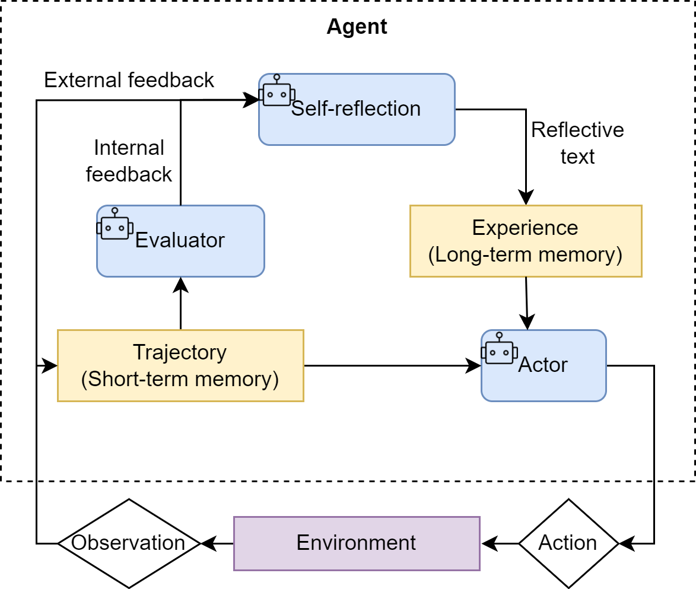

优势：
1. **内部纠错回路**：它为智能体提供了一个内部纠错回路，使其不再完全依赖于外部工具的反馈（ReAct 的 Observation），从而能够修正更高层次的逻辑和策略错误。
2. **持续优化迭代**：它将一次性的任务执行，转变为一个持续优化的过程，提升了复杂任务的最终成功率和答案质量。
3. **构建短期记忆**：它为智能体构建了一个临时的“短期记忆”。整个“执行-反思-优化”的过程，形成了一个宝贵的经验记录，Agent 不仅知道最终答案，还记得自己是如何从有缺陷的初稿迭代到最终版本的。更进一步，这个记忆系统还可以是多模态的，允许 Agent 反思和修正文本以外的输出（如代码、图像等），为构建更强大的多模态 Agent 奠定了基础。

---

#### 4.4.2 Reflection 模式代码实现

引入记忆管理机制，因为 reflection 通常对应着信息的存储和提取，如果上下文足够长的情况，想让“评审员”直接获取所有的信息然后进行反思往往会传入很多冗余信息。

这一步的目标任务是：“编写一个 Python 函数，找出 1 到 n 之间所有的素数 (prime numbers)。”

这个任务是检验 Reflection 机制的绝佳场景：
- **存在明确的优化路径**：大语言模型初次生成的代码很可能是一个简单但效率低下的试除或递归实现。
- **反思点清晰**：可以通过反思发现其“时间复杂度过高”或“存在重复计算”的问题。
- **优化方向明确**：可以根据反馈，将其优化为更高效的迭代版本或使用备忘录模式的版本。

Reflection 的核心在于迭代，而迭代的前提是能够记住之前的尝试和获得的反馈。因此，一个“短期记忆”模块是实现该范式的必需品。这个记忆模块将负责存储每一次“执行-反思”循环的完整轨迹。

##### 1. 记忆模块 ([Chapter04/Memory.py](Chapter04/Memory.py))
主体结构如下：
- 使用一个列表 `records` 来按顺序存储每一次的行动和反思；
- `add_record` 方法追加记忆；
- `get_trajectory` 方法是核心，它将记忆轨迹“序列化”成一段文本，可以直接插入到后续的提示词中，为模型的反思和优化提供完整的上下文；
- `get_last_execution` 方便我们获取最新的“初稿”以供反思。

##### 2. 构建提示词 ([Chapter04/prompts/__init__.py](Chapter04/prompts/__init__.py))
- **初始执行提示词 (Execution Prompt)**：这是智能体首次尝试解决问题的提示词，内容相对直接，只要求模型完成指定任务。
- **反思提示词 (Reflection Prompt)**：这个提示词是 Reflection 机制的灵魂。它指示模型扮演“代码评审员”的角色，对上一轮生成的代码进行批判性分析，并提供具体的、可操作的反馈。
- **优化提示词 (Refinement Prompt)**：当收到反馈后，这个提示词将引导模型根据反馈内容，对原有代码进行修正和优化。

##### 3. 智能体核心类 ([Chapter04/ReflectionAgent.py](Chapter04/ReflectionAgent.py))

> ⚠️ **踩坑记录：否定句假阳性 Bug**  
> 原终止检查逻辑如下：
> ```python
> # 检查是否需要停止
> if "无需改进" in feedback:
> ```
> 运行中大模型输出：  
> `结论：当前实现不是算法层面最优；6k±1 试除只是常数优化，大整数性能会迅速恶化。因此，当前代码在算法效率上存在明显瓶颈，不能回答“无需改进”。`  
> 由于 Python 简单的子串匹配，将模型“**不能**回答‘无需改进’”反向误判为“无需改进”，导致智能体在第 1 轮直接提前跳出循环。

````text
日志复盘：
--- 开始处理任务 ---
任务:
    写一个函数来判断一个整数是否为素数

    - 如果是素数，则直接返回 True
    - 如果不是素数，则返回 False

--- 正在进行初始尝试 ---
🧠 正在调用 deepseek-v4.1-flash 模型...
✅ 大语言模型响应成功:
def is_prime(n: int) -> bool:
...

📝 记忆已更新，新增一条 'execution' 记录
--- 第 1/3 轮迭代 ---

-> 正在进行反思...
🧠 正在调用 deepseek-v4.1-flash 模型...
✅ 大语言模型响应成功:
结论：当前实现不是算法层面最优；6k±1 试除只是常数优化，大整数性能会迅速恶化。
因此，当前代码在算法效率上存在明显瓶颈，不能回答“无需改进”。
📝 记忆已更新，新增一条 'reflection' 记录。

✅ 反思认为代码已无需改进，任务完成。（❌ 触发 Bug 提前退出）

--- 任务完成 ---
````

- **解决方案**：修改提示词规范与判定逻辑，要求模型仅在达到最优时，在末尾单独输出专属标记 `[无需改进]`；智能体代码同步匹配 `if "[无需改进]" in feedback:`，彻底消除误判。

---

#### 4.4.3 Reflection 优缺点分析

##### 为什么将“审查反思”与“优化重写”解耦？

1. **破除主观偏见（角色解耦）**：  
   自己写完立刻自己 Review 极易产生“确认偏误”（人类与模型皆如此）。将“挑刺评审员”与“程序员”角色分离，模型才能毫无包袱地给出深刻的批判性反馈。
2. **分配认知负荷（专注推理）**：  
   单次生成的注意力容量有限。拆分后，反思阶段专注算法推演与瓶颈分析，优化阶段专注语法规范与代码实现，避免“反思浅尝辄止、代码换汤不换药”。
3. **设定控制门控（优雅退出）**：  
   若混在一起，智能体无法准确判断何时停机，即便代码已最优，模型为响应指令仍会强行挑刺并全量重写，导致无限死循环或耗尽 `max_iterations`；独立审查能充当“守门员”，及时熔断、节约 Token。

##### 优缺点对比
- **优点**：
  - **持续优化**：不断迭代提升答案质量；
  - **自主闭环**：自动审查纠错，大幅提高可靠性。
- **缺点**：
  - **模型调用开销增加**：这是最直接的成本，每进行一轮迭代至少需要额外调用两次大语言模型；
  - **时间与金钱成本**：多次网络调用带来额外的 API 计费与等待耗时；
  - **工程复杂度更高**：需要针对评审员与程序员分别精调提示词与终止规约。

##### 适用场景
适合那些对最终结果的质量、准确性和可靠性有极高要求，且对任务完成的实时性要求相对宽松的场景：
- 生成关键的业务代码或技术报告；
- 在科学研究中进行复杂的逻辑推演；
- 需要深度分析和规划的决策支持系统。

---

## 本章小结

- **ReAct**：我们构建了一个能与外部世界交互的 ReAct 智能体。通过“思考-行动-观察”的动态循环，它成功地利用搜索引擎回答了自身知识库无法覆盖的实时性问题。其核心优势在于**环境适应性**和**动态纠错能力**，使其成为处理探索性、需要外部工具输入的任务的首选。
- **Plan-and-Solve**：我们实现了一个先规划后执行的 Plan-and-Solve 智能体，并利用它解决了需要多步推理的数学应用题。它将复杂的任务分解为清晰的步骤，然后逐一执行。其核心优势在于**结构性**和**稳定性**，特别适合处理逻辑路径确定、内部推理密集的任务。
- **Reflection (自我反思与迭代)**：我们构建了一个具备自我优化能力的 Reflection 智能体。通过引入“执行-反思-优化”的迭代循环，它成功地将一个效率较低的初始代码方案，优化为了一个算法上更优的高性能版本。其核心价值在于**显著提升解决方案的质量**，适用于对结果的准确性和可靠性有极高要求的场景。

## 第五章 基于低代码平台的智能体搭建

### 5.1 低代码平台基本认知

- **降低技术门槛**：低代码平台将复杂的技术细节（如 API 调用、状态管理、并发控制）封装成一个个易于理解的“节点”或“模块”。用户无需精通编程，只需通过拖拽、连接这些节点，就能构建出功能强大的工作流。这使得产品经理、设计师、业务专家等非技术人员也能参与到智能体的设计与创造中来，极大地拓宽了创新的边界。
- **提升开发效率**：对于专业开发者而言，平台同样能带来巨大的效率提升。在项目初期，当需要快速验证一个想法或搭建一个原型 (Prototype) 时，使用低代码平台可以在数小时甚至数分钟内完成原本需要数天编码的工作。开发者可以将精力更多地投入到业务逻辑梳理和提示工程优化上，而非底层的工程实现。
- **提供更优的可视化与可观测性**：相比于在终端中打印日志，图形化的平台天然提供了对智能体运行轨迹的端到端可视化。你可以清晰地看到数据在每一个节点之间如何流动，哪一个环节耗时最长，哪一个工具调用失败。这种直观的调试体验，是纯代码开发难以比拟的。
- **标准化与最佳实践沉淀**：优秀的低代码平台通常会内置许多行业内的最佳实践。例如，它会提供预设的 ReAct 模板、优化的知识库检索引擎、标准化的工具接入规范等。这不仅避免了开发者“踩坑”，也使得团队协作更加顺畅，因为所有人都基于同一套标准和组件进行开发。
简而言之，低代码平台并非要取代代码，而是提供了一种更高层次的抽象。它让我们可以从繁琐的底层实现中解放出来，更专注于智能体“思考”与“行动”的逻辑本身，从而更快、更好地将创意变为现实。

Coze

- **核心定位**：由字节跳动推出的 Coze，主打零代码/低代码的 Agent 的构建体验，让不具备编程背景的用户也能轻松创造。
- **特点分析**：Coze 拥有极其友好的可视化界面，用户可以像搭建乐高积木一样，通过拖拽插件、配置知识库和设定工作流来创建智能体。其内置了极为丰富的插件库，并支持一键发布到抖音、飞书、微信公众号等多个主流平台，极大地简化了分发流程。
- **适用人群**：AI 应用的入门用户、产品经理、运营人员，以及希望快速将创意变为可交互产品的个人创作者。
Dify

- **核心定位**：Dify 是一个开源的、功能全面的 LLM 应用开发与运营平台，旨在为开发者提供从原型构建到生产部署的一站式解决方案。
- **特点分析**：它融合了后端服务和模型运营的理念，支持 Agent 工作流、RAG Pipeline、数据标注与微调等多种能力。对于追求专业、稳定、可扩展的企业级应用而言，Dify 提供了坚实的基础。
- **适用人群**：有一定技术背景的开发者、需要构建可扩展的企业级 AI 应用的团队。
FastGPT

- **核心定位**：FastGPT 是一个开源的、基于 LLM 大语言模型的知识库问答平台与 Agent 构建工具，专注于提供简单易用的 RAG（检索增强生成）解决方案和可视化工作流编排能力。
- **特点分析**：FastGPT 最核心的优势在于其对知识库问答场景的极致优化。它提供了从数据导入、自动文本分块、向量化存储到智能检索的完整 RAG 链路，并支持通过直观的可视化界面（Flow 模块）编排复杂的对话流程和 Agent 工作流。平台采用模型中立设计，可灵活对接 OpenAI、Claude、通义千问等多种国内外主流大模型，同时提供了完善的 API 接口和插件市场，便于与企业微信、钉钉、飞书等现有系统快速集成。
- **适用人群**：希望基于私有知识库快速搭建智能客服、企业内部知识助手、文档问答机器人的开发者和中小企业团队，以及对 RAG 技术感兴趣但希望降低实现门槛的技术爱好者。
n8n

- **核心定位**：n8n 本质上是一个开源工作流自动化工具，而非纯粹的 LLM 平台。近年来，它积极集成了 AI 能力。
特点分析：n8n 的强项在于“连接”。它拥有数百个预置的节点，可以轻松地将各类 SaaS 服务、数据库、API 连接成复杂的自动化业务流程。你可以在这个流程中嵌入 LLM 节点，使其成为整个自动化链路中的一环。虽然在 LLM 功能的专一度上不如前两者，但其通用自动化能力是独一无二的。不过，其学习曲线也相对陡峭。
适用人群：需要将 AI 能力深度整合进现有业务流程、实现高度定制化自动化的开发者和企业。

### 5.2 coze

https://raw.githubusercontent.com/datawhalechina/Hello-Agents/main/docs/images/5-figures/coze-01.png

点击左边侧栏的加号就可以看到创建智能体的入口了，这里目前有两类AI应用，一种是创建智能体，另一种叫应用。其中智能体又分为单智能体自主规划模式、单智能体对话流模式和多智能体模式。AI应用也分两种不仅能设计桌面网页端的用户界面，还能轻松搭建小程序和 H5 端的界面。
项目空间里是你的智能体仓库，这里放着你所有开发的智能体或复制的智能体/应用，也是在扣子进行智能体开发你最经常来到的地方，如图5.3所示
https://raw.githubusercontent.com/datawhalechina/Hello-Agents/main/docs/images/5-figures/coze-03.png
资源库是你开发扣子智能体的核心武器库，资源库就会存放你的工作流，知识库，卡片，提示词库等等一系列开发智能体的工具。你能做出什么样的智能体，首先取决于模型的能力，但是最重要的还是要看你怎么给智能体搭配“出装和技能”。模型决定了智能体的下限，但是扣子资源库给了你智能体的能力的无穷上限，让你能够按照自己的想法，开发想象力和脑洞进行智能体的开发，如图5.4所示。
https://raw.githubusercontent.com/datawhalechina/Hello-Agents/main/docs/images/5-figures/coze-04.png
空间配置包含智能体、插件、工作流和发布渠道的一个统一的管理频道，以及模型管理就是你可以在这里看到你调用的各种大模型，如图5.5所示。
https://raw.githubusercontent.com/datawhalechina/Hello-Agents/main/docs/images/5-figures/coze-05.png

如果让我对扣子的智能体开发做一个简单的总结的话，我会把他比喻成一个游戏的各个组成部分，各部分配合组合出一个一个精彩的智能体像极了打“游戏”，每做完一个智能体都像是打完了一个boss并且收获满满，不管是“经验”还是“装备”。
工作流： 关卡通关路线图
对话流：NPC 对话通关
插件：角色技能卡
知识库：游戏百科全书
卡片：快捷道具栏
提示词：角色的移动键
数据库：“云存档”
发布管理：关卡审核员
模型管理：游戏角色库或者叫捏脸系统
效果评测：闯关评分系统

#### 5.2.1 扣子创建智能体
从零开始构建一个功能强大的“每日AI简报”智能体。该智能体能够自动化地从多个信息源（包括36氪、虎嗅、it之家、infoq、GitHub、arXiv）抓取当日最新的AI领域头条新闻、学术论文及开源项目动态，并将其结构化、专业化地整合成一份生动、精炼的简报。
访问 https://www.coze.cn/space/ 进入工作空间并创建智能体。
步骤一：创建工作流

在资源库界面，选择 +资源——工作流，创建工作流，如图 5.6 所示。
https://raw.githubusercontent.com/datawhalechina/Hello-Agents/main/docs/images/5-figures/coze-06.png

2. 个性化配置: 对每一个插件进行精细化配置，以确保其能精准地获取所需数据。例如，在 RSS 插件中，输入36氪、虎嗅等网站的特定RSS订阅链接；在 GitHub 插件中，设置需监控的关键词查询数量以及最新更新设置；在 arXiv 插件中，定义感兴趣的领域关键词，如“LLM”、“AI”等，定义数量以及最新更新设置。

编排连接，填插件参数、大模型参数
https://raw.githubusercontent.com/datawhalechina/Hello-Agents/main/docs/images/5-figures/coze-11.png

步骤三：设定智能体角色与提示词
可以通过配置系统提示词（System Prompt）和用户提示词（User Prompt）定义智能体的行为逻辑
（1）角色设定

我们将智能体设定为一位资深且权威的科技媒体编辑。这一角色赋予了智能体明确的专业定位，使其在后续的内容创作中，能够模仿专业编辑的思维模式，进行高效的信息筛选、整合与概括。

（2）提示词编写与结构化

提示词是智能体执行任务的指导手册。我们将其分为系统提示（System Prompt）和用户提示（User Prompt），以确保指令的清晰、完整与可控。 系统提示（System Prompt）
优点：门槛低，简单，只需拖拽，可调接口api.灵活调整输入输出和中间内容。
缺点：不支持MCP,导入导出收费
#### 5.2.2 Dify智能体搭建
使用 Dify 构建一个功能全面的超级智能体个人助手，涵盖日常问答、文案优化、多模态生成、数据分析等多个场景。

没仔细看，步骤复杂。
核心优势
全栈式开发体验：Dify 将 RAG 管道、AI 工作流、模型管理等功能整合到一个平台中，提供一站式的开发体验
低代码与高扩展性的平衡：Dify 在低代码开发的便利性和专业开发的灵活性之间取得了良好平衡
企业级安全与合规：Dify 提供 AES-256 加密、RBAC 权限控制和审计日志等功能，满足严格的安全和合规要求
丰富的工具集成能力：Dify 支持 9000 + 工具和 API 扩展，提供了广泛的功能扩展性
活跃的开源社区：Dify 拥有活跃的开源社区，提供了丰富的学习资源和支持
主要局限
学习曲线较陡：对于完全没有技术背景的用户，仍然存在一定的学习曲线
性能瓶颈：在高并发场景下可能面临性能挑战，需要进行适当的优化。Dify 系统的核心服务端组件由 Python 语言实现，与 C++、Golang、Rust 等语言相比，性能表现相对较差
多模态支持不足：当前主要以文本处理为主，对图像、视频、HTML等的支持有限
企业版成本较高：Dify 的企业版定价相对较高，可能超出小型团队的预算
API 兼容性问题：Dify 的 API 格式不兼容 OpenAI，可能限制与某些第三方系统的集成

### 5.2.3 FastGPT
FastGPT 是一个开源的、基于大语言模型的知识库问答平台与 Agent 构建工具，其核心定位是"企业级 AI 生产力引擎"，专注于提供简单易用的** RAG（检索增强生成）**解决方案和可视化工作流编排能力。与 Coze 的零代码体验和 Dify 的全栈开发能力不同，FastGPT 将知识库问答作为第一等公民，围绕"数据导入—智能分块—向量检索—对话生成"这一完整链路进行了深度优化。

### 5.2.4 n8n
这几个都是可视化搭建Agent和AI应用的工具，魔搭有mcp

Coze 以其零代码的友好体验和丰富的插件生态脱颖而出。通过"每日AI简报"案例，我们体验了如何通过拖拽式配置快速整合多源信息，并一键发布到多个主流平台。Coze 特别适合非技术背景用户和需要快速验证创意的场景，但其不支持 MCP 和无法导出标准化配置文件的局限性也值得注意。

Dify 作为开源的企业级平台，展现了全栈式开发能力。"超级智能体个人助手"案例涵盖了日常问答、文案优化、多模态生成、数据分析和 MCP 工具集成等多个模块，充分展示了 Dify 在复杂业务场景下的强大编排能力。其丰富的插件市场(8000+)、灵活的部署方式和企业级安全特性，使其成为专业开发者和企业团队的理想选择。然而，相对陡峭的学习曲线和在高并发场景下的性能挑战也需要权衡。

FastGPT 则凭借其极致的 RAG 知识库体验，成为垂直领域问答场景的有力竞争者。通过"智能投顾助手"案例，我们体验了从知识库构建、MCP 工具接入到可视化工作流编排的完整开发范式。FastGPT 对文件分块、索引增强、图片识别等细节的精细化控制，使其在企业知识助手、智能客服等场景中具有独特优势。但其模板生态相对薄弱、免费版额度有限，也限制了其在更复杂业务场景中的发挥。

n8n 则以其独特的"连接"能力开辟了另一条路径。通过"智能邮件助手"案例，我们看到了如何将 AI 能力无缝嵌入到复杂的业务自动化流程中。n8n 的 AI Agent 节点将模型、记忆和工具高度整合，配合其数百个预置节点，能够实现高度定制化的自动化方案。其支持私有化部署的特性对注重数据安全的企业尤为重要。但内置存储的非持久性和版本控制的不成熟，在生产环境中需要额外的工程化处理。

通过四个平台的对比实践，我们可以得出以下选型建议:

快速原型验证、非技术用户: 优先选择 Coze
企业级应用、复杂业务逻辑、多模态生成: 优先选择 Dify
基于私有知识库的问答系统、智能客服: 优先选择 FastGPT
深度业务集成、通用自动化流程: 优先选择 n8n

## 第六章 框架开发实践

一个框架的本质，是提供一套经过验证的“规范”。它将所有智能体共有的、重复性的工作（如主循环、状态管理、工具调用、日志记录等）进行抽象和封装，让我们在构建新的智能体时，能够专注于其独特的业务逻辑，而非通用的底层实现。

提升代码复用与开发效率：这是最直接的价值。一个好的框架会提供一个通用的 Agent 基类或执行器，它封装了智能体运行的核心循环（Agent Loop）。无论是 ReAct 还是 Plan-and-Solve，都可以基于框架提供的标准组件快速搭建，从而避免重复劳动。
实现核心组件的解耦与可扩展性：一个健壮的智能体系统应该由多个松散耦合的模块组成。框架的设计会强制我们分离不同的关注点：
模型层 (Model Layer)：负责与大语言模型交互，可以轻松替换不同的模型（OpenAI, Anthropic, 本地模型）。
工具层 (Tool Layer)：提供标准化的工具定义、注册和执行接口，添加新工具不会影响其他代码。
记忆层 (Memory Layer)：处理短期和长期记忆，可以根据需求切换不同的记忆策略（如滑动窗口、摘要记忆）。 这种模块化的设计使得整个系统极具可扩展性，更换或升级任何一个组件都变得简单。
标准化复杂的状态管理：我们在 ReflectionAgent 中实现的 Memory 类只是一个简单的开始。在真实的、长时运行的智能体应用中，状态管理是一个巨大的挑战，它需要处理上下文窗口限制、历史信息持久化、多轮对话状态跟踪等问题。一个框架可以提供一套强大而通用的状态管理机制，开发者无需每次都重新处理这些复杂问题。
简化可观测性与调试过程：当智能体的行为变得复杂时，理解其决策过程变得至关重要。一个精心设计的框架可以内置强大的可观测性能力。例如，通过引入事件回调机制（Callbacks），我们可以在智能体生命周期的关键节点（如 on_llm_start, on_tool_end, on_agent_finish）自动触发日志记录或数据上报，从而轻松地追踪和调试智能体的完整运行轨迹。这远比在代码中手动添加 print 语句要高效和系统化。

### 6.1 主流框架的选型与对比
utoGen：AutoGen 的核心思想是通过对话实现协作[1]。它将多智能体系统抽象为一个由多个“可对话”智能体组成的群聊。开发者可以定义不同角色（如 Coder, ProductManager, Tester），并设定它们之间的交互规则（例如，Coder 写完代码后由 Tester 自动接管）。任务的解决过程，就是这些智能体在群聊中通过自动化消息传递，不断对话、协作、迭代直至最终目标达成的过程。
AgentScope：AgentScope 是一个专为多智能体应用设计的、功能全面的开发平台[2]。它的核心特点是易用性和工程化。它提供了一套非常友好的编程接口，让开发者可以轻松定义智能体、构建通信网络，并管理整个应用的生命周期。其内置的消息传递机制和对分布式部署的支持，使其非常适合构建和运维复杂、大规模的多智能体系统。
CAMEL：CAMEL 提供了一种新颖的、名为角色扮演 (Role-Playing) 的协作方法[3]。其核心理念是，我们只需要为两个智能体（例如，AI研究员 和 Python程序员）设定好各自的角色和共同的任务目标，它们就能在“初始提示 (Inception Prompting)”的引导下，自主地进行多轮对话，相互启发、相互配合，共同完成任务。它极大地降低了设计多智能体对话流程的复杂度。
LangGraph：作为 LangChain 生态的扩展，LangGraph 另辟蹊径，将智能体的执行流程建模为图 (Graph)[4]。在传统的链式结构中，信息只能单向流动。而 LangGraph 将每一步操作（如调用LLM、执行工具）定义为图中的一个节点 (Node)，并用边 (Edge) 来定义节点之间的跳转逻辑。这种设计天然支持循环 (Cycles)，使得实现如 Reflection 这样的迭代、修正、自我反思的复杂工作流变得异常简单和直观。

### 6.2 框架一：AutoGen
以对话驱动协作"。它巧妙地将复杂的任务解决流程，映射为不同角色的智能体之间的一系列自动化对话。

分层设计： 框架被拆分为两个核心模块：
autogen-core：作为框架的底层基础，封装了与语言模型交互、消息传递等核心功能。它的存在保证了框架的稳定性和未来扩展性。
autogen-agentchat：构建于 core 之上，提供了用于开发对话式智能体应用的高级接口，简化了多智能体应用的开发流程。 这种分层策略使得各组件职责明确，降低了系统的耦合度。
异步优先： 新架构全面转向异步编程 (async/await)。在多智能体协作场景中，网络请求（如调用 LLM API）是主要耗时操作。异步模式允许系统在等待一个智能体响应时处理其他任务，从而避免了线程阻塞，显著提升了并发处理能力和系统资源的利用效率。
智能体是执行任务的基本单元。在 0.7.4 版本中，智能体的设计更加专注和模块化。

AssistantAgent (助理智能体)： 这是任务的主要解决者，其核心是封装了一个大型语言模型（LLM）。它的职责是根据对话历史生成富有逻辑和知识的回复，例如提出计划、撰写文章或编写代码。通过不同的系统消息（System Message），我们可以为其赋予不同的“专家”角色。
UserProxyAgent (用户代理智能体)： 这是 AutoGen 中功能独特的组件。它扮演着双重角色：既是人类用户的“代言人”，负责发起任务和传达意图；又是一个可靠的“执行器”，可以配置为执行代码或调用工具，并将结果反馈给其他智能体。这种设计清晰地区分了“思考”（由 AssistantAgent 完成）与“行动”。

综合来看就是设置多个角色，比如产品经理、测试、开发等，用户提出需求后它们互相对话完成任务。

### 6.3 框架二：AgentScope

在这个架构中，最底层是基础组件层 (Foundational Components)，它为整个框架提供了核心的构建块。Message 组件定义了统一的消息格式，支持从简单的文本交互到复杂的多模态内容；Memory 组件提供了短期和长期记忆管理；Model API 层抽象了对不同大语言模型的调用；而 Tool 组件则封装了智能体与外部世界交互的能力。

在基础组件之上，智能体基础设施层 (Agent-level Infrastructure) 提供了更高级的抽象。这一层不仅包含了各种预构建的智能体（如浏览器使用智能体、深度研究智能体），还实现了经典的 ReAct 范式，支持智能体钩子、并行工具调用、状态管理等高级特性。特别值得注意的是，这一层原生支持异步执行与实时控制，这是 AgentScope 相比其他框架的一个重要优势。

多智能体协作层 (Multi-Agent Cooperation) 是 AgentScope 的核心创新所在。MsgHub 作为消息中心，负责智能体间的消息路由和状态管理；而 Pipeline 系统则提供了灵活的工作流编排能力，支持顺序、并发等多种执行模式。这种设计使得开发者可以轻松构建复杂的多智能体协作场景。

最上层的开发与部署层 (Deployment & Development)则体现了 AgentScope 对工程化的重视。AgentScope Runtime 提供了生产级的运行时环境，而 AgentScope Studio 则为开发者提供了完整的可视化开发工具链。

AgentScope 的核心创新在于其消息驱动架构。在这个架构中，所有的智能体交互都被抽象为消息的发送和接收，而不是传统的函数调用。

### 6.4 框架三：CAMEL
CAMEL最初的核心目标是探索如何在最少的人类干预下，让两个智能体通过“角色扮演”自主协作解决复杂任务。
一个扮演“AI 用户” (AI User)，负责提出需求、下达指令和构思任务步骤；另一个则扮演“AI 助理” (AI Assistant)，负责根据指令执行具体操作和提供解决方案。
例如，在一个“开发股票交易策略分析工具”的任务中：

AI 用户 的角色可能是一位“资深股票交易员”。它懂市场、懂策略，但不懂编程。
AI 助理 的角色则是一位“优秀的 Python 程序员”。它精通编程，但对股票交易一无所知。
通过这种设定，任务的解决过程就被自然地转化为一场两位“跨领域专家”之间的对话。交易员提出专业需求，程序员将其转化为代码实现，两者协作完成任何一方都无法独立完成的复杂任务。

### 6.5 框架四：LangGraph
与前面介绍的基于“对话”的框架（如 AutoGen 和 CAMEL）不同，LangGraph 将智能体的执行流程建模为一种状态机（State Machine），并将其表示为有向图（Directed Graph）。在这种范式中，图的节点（Nodes）代表一个具体的计算步骤（如调用 LLM、执行工具），而边（Edges）则定义了从一个节点到另一个节点的跳转逻辑。这种设计的革命性之处在于它天然支持循环，使得构建能够进行迭代、反思和自我修正的复杂智能体工作流变得前所未有的直观和简单。
三个基本构成要素。
首先，是全局状态（State）。整个图的执行过程都围绕一个共享的状态对象进行。这个状态通常被定义为一个 Python 的 TypedDict，它可以包含任何你需要追踪的信息，如对话历史、中间结果、迭代次数等。所有的节点都能读取和更新这个中心状态。
其次，是节点（Nodes）。每个节点都是一个接收当前状态作为输入、并返回一个更新后的状态作为输出的 Python 函数。节点是执行具体工作的单元。
最后，是边（Edges）。边负责连接节点，定义工作流的方向。最简单的边是常规边，它指定了一个节点的输出总是流向另一个固定的节点。而 LangGraph 最强大的功能在于条件边（Conditional Edges）。它通过一个函数来判断当前的状态，然后动态地决定下一步应该跳转到哪个节点。这正是实现循环和复杂逻辑分支的关键。
在定义了状态、节点和边之后，我们可以像搭积木一样将它们组装成一个可执行的工作流。
LangGraph 将一个完整的实时问答流程，显式地定义为一个由状态、节点和边构成的“流程图”。这种设计的最大优势是高度的可控性与可预测性。开发者可以精确地规划智能体的每一步行为，这对于构建需要高可靠性和可审计性的生产级应用至关重要。其最强大的特性在于对循环（Cycles）的原生支持。通过条件边，我们可以轻松构建“反思-修正”循环，例如在我们的案例中，如果搜索失败，可以设计一个回退到备用方案的路径。这是构建能够自我优化和具备容错能力的智能体的关键。

此外，由于每个节点都是一个独立的 Python 函数，这带来了高度的模块化。同时，在流程中插入一个等待人类审核的节点也变得非常直接，为实现可靠的“人机协作”（Human-in-the-loop）提供了坚实的基础。

（2）局限性

与基于对话的框架相比，LangGraph 需要开发者编写更多的前期代码（Boilerplate）。定义状态、节点、边等一系列操作，使得对于简单任务而言，开发过程显得更为繁琐。开发者需要更多地思考“如何控制流程（how）”，而不仅仅是“做什么（what）”。


## 第七章 构建你的智能体框架
过度抽象的复杂性：许多框架为了追求通用性，引入了大量抽象层和配置选项。以LangChain为例，其链式调用机制虽然灵活，但对初学者而言学习曲线陡峭，往往需要理解大量概念才能完成简单任务。
快速迭代带来的不稳定性：商业化框架为了抢占市场，API接口变更频繁。开发者经常面临版本升级后代码无法运行的困扰，维护成本居高不下。
黑盒化的实现逻辑：许多框架将核心逻辑封装得过于严密，开发者难以理解Agent的内部工作机制，缺乏深度定制能力。遇到问题时只能依赖文档和社区支持，尤其是如果社区不够活跃，可能一个反馈意见会非常久也没有人推进，影响后续的开发效率。
依赖关系的复杂性：成熟框架往往携带大量依赖包，安装包体积庞大，在需要与别的项目代码配合使用可能出现依赖冲突问题

HelloAgents框架的设计围绕着一个核心问题展开：如何让学习者既能快速上手，又能深入理解Agent的工作原理？

目录结构
hello-agents/
├── hello_agents/
│   │
│   ├── core/                     # 核心框架层
│   │   ├── agent.py              # Agent基类
│   │   ├── llm.py                # HelloAgentsLLM统一接口
│   │   ├── message.py            # 消息系统
│   │   ├── config.py             # 配置管理
│   │   └── exceptions.py         # 异常体系
│   │
│   ├── agents/                   # Agent实现层
│   │   ├── simple_agent.py       # SimpleAgent实现
│   │   ├── react_agent.py        # ReActAgent实现
│   │   ├── reflection_agent.py   # ReflectionAgent实现
│   │   └── plan_solve_agent.py   # PlanAndSolveAgent实现
│   │
│   ├── tools/                    # 工具系统层
│   │   ├── base.py               # 工具基类
│   │   ├── registry.py           # 工具注册机制
│   │   ├── chain.py              # 工具链管理系统
│   │   ├── async_executor.py     # 异步工具执行器
│   │   └── builtin/              # 内置工具集
│   │       ├── calculator.py     # 计算工具
│   │       └── search.py         # 搜索工具
└──
pip install "hello-agents==0.1.1"
