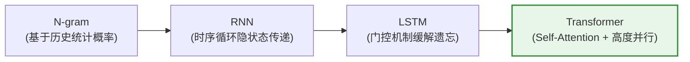
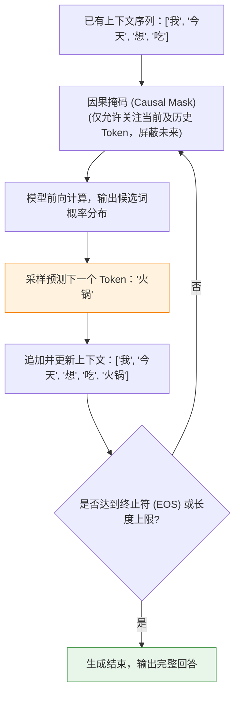
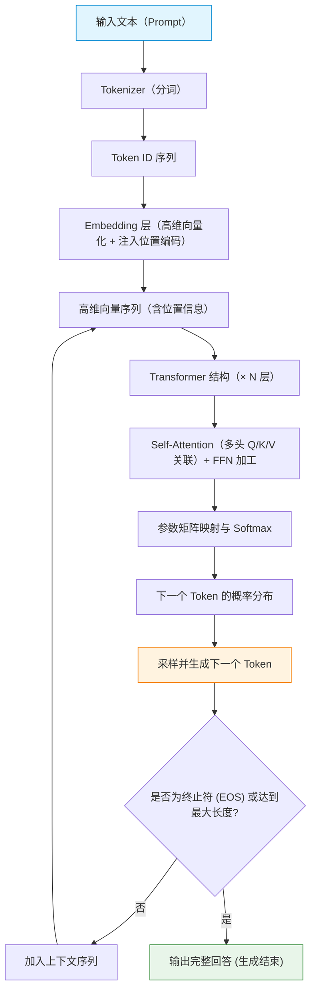
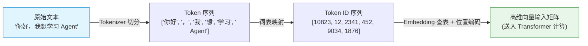
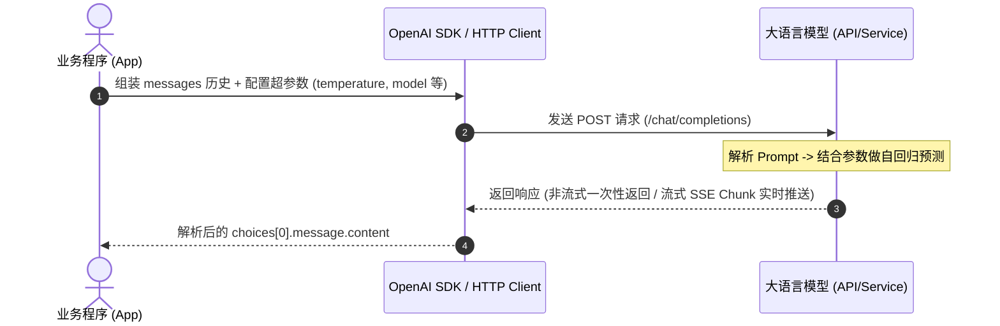
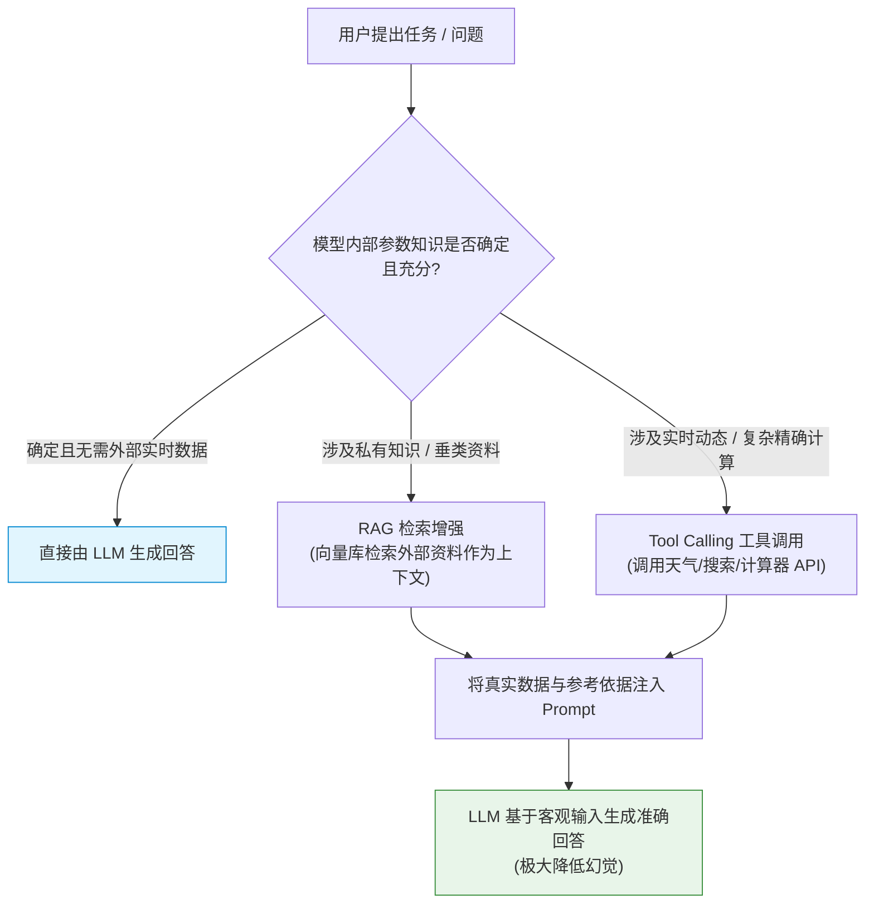
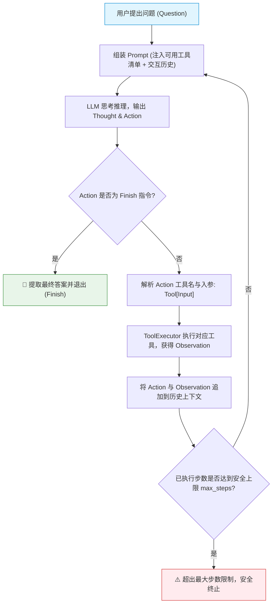
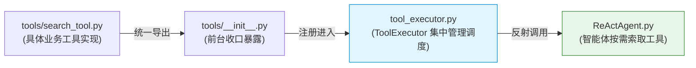

# Hello Agent 学习笔记

本项目记录 AI 智能体（Agent）从零学习与实战过程，涵盖环境搭建、Git 版本管理、ReAct 核心范式实现及工具动态调用。

---

## 一、预备工作

### 1. Git 初始化与远程关联

| 步骤 | 操作 | 对应命令 | 说明 |
| :---: | :--- | :--- | :--- |
| **01** | 创建并进入目录 | `mkdir demo && cd demo` | 准备工作目录 |
| **02** | 初始化 Git 仓库 | `git init` | 本地生成 `.git` 管理目录 |
| **03** | 编写忽略文件 | 新建并编辑 `.gitignore` | 必须在 `add` 前完成，忽略 `.venv/` 与 `.env` |
| **04** | 暂存所有修改 | `git add .` | 将工作区变动提交到暂存区 |
| **05** | 提交本地快照 | `git commit -m "feat: initial commit"` | 形成第一个本地版本快照 |
| **06** | 远端创建仓库 | 在 GitHub 点击 New repository | ⚠️ 保持空仓库，不要勾选生成 README |
| **07** | 规范主分支名 | `git branch -M main` | 统一分支名为 `main`，与 GitHub 保持一致 |
| **08** | 关联远端仓库 | `git remote add origin <URL>` | 建立本地与 GitHub 仓库的远程映射通道 |
| **09** | 首次推送绑定 | `git push -u origin main` | 首次带 `-u` 绑定上游分支，后续仅需 `git push` |

> 📌 **Git 撤销备忘**：若误把 `.venv` 放入了暂存区，可执行 `git restore --staged .venv` 撤回暂存（保留本地物理文件）。

---

### 2. Python 虚拟环境与依赖管理

```powershell
# 1. 创建虚拟环境
python -m venv .venv

# 2. 激活虚拟环境 (Windows PowerShell / CMD)
.venv\Scripts\activate

# 3. 安装项目依赖
pip install python-dotenv requests openai tavily-python

# 4. 退出虚拟环境
deactivate
```

---

## 二、第一章：Agent 基础（智能旅行助手）

### 1. 目录结构

```text
hello-agent-learn/
├── .env                  # 本地真实环境变量（已加入 .gitignore，防泄密）
├── .env.example          # 环境变量示例模板（提交至 Git 供参考）
├── .gitignore            # Git 忽略配置
├── readme.md             # 项目学习笔记
└── Chapter01/
    ├── main.py           # 主入口：装配组件并驱动 ReAct 循环
    ├── llm/
    │   └── llm.py        # 大模型客户端（兼容 OpenAI 协议）
    ├── prompts/
    │   └── system_prompts.md  # 系统提示词（Prompt 模板）
    └── tools/
        └── tools_register.py  # 工具定义与注册表（实时天气与景点搜索）
```

---

### 2. 环境变量配置 (.env)

克隆项目后，首先在项目根目录下通过模板复制 `.env`：

```powershell
copy .env.example .env
```

在生成的 `.env` 文件中填入实际凭据：

```ini
# 大模型配置（支持 DeepSeek / 商汤 / OpenAI 等兼容接口）
OPENAI_API_KEY="你的API_KEY"
OPENAI_BASE_URL="https://token.sensenova.cn/v1"   # ⚠️ 注意：末尾无需 /chat/completions
MODEL_ID="deepseek-v4.1-flash"

# 外部工具配置（Tavily 搜索）
TAVILY_API_KEY="你的Tavily_KEY"
```

> 💡 **Tavily API Key 获取方式**：
> 1. 前往官网 [tavily.com](https://tavily.com/)（支持使用 GitHub 账号一键授权登录）；
> 2. 在控制台 Dashboard 首页直接复制生成的 API Key（格式为 `tvly-xxxxxx`，每月提供 1000 次免费调用）；
> 3. 将其填入 `.env` 中的 `TAVILY_API_KEY`，Agent 即可联网搜索真实景点信息。

---

### 3. 核心模块与代码逻辑

- **`prompts/system_prompts.md`**  
  纯文本定义智能旅行助手角色、输出规范（严格遵循 `Thought:` 与 `Action:` 成对输出）及任务结束指令 `Finish[最终答案]`。

- **`tools/tools_register.py`**  
  - `get_weather(city)`：调用 `wttr.in` 查询指定城市实时天气。
  - `get_attraction(city, weather)`：调用 `TavilyClient` 联网搜索匹配天气的旅游景点。
  - `available_tools`：统一工具字典映射，供主循环根据模型输出的函数名动态反射调用。

- **`llm/llm.py`**  
  基于官方 `openai` SDK 封装 `OpenAICompatibleClient`，实现统一的大模型服务调用。

- **`main.py`**  
  核心调度中心，启动 ReAct 闭环循环（最多 5 轮迭代）：
  
  ```text
  用户输入 ──> 大模型思考 (Thought) ──> 工具调用 (Action) ──> 观察环境 (Observation) ──> 任务结束 (Finish)
  ```

---

### 4. 运行测试

```powershell
python Chapter01/main.py
```


## 三、第二、三章：大模型基本原理

> 📌 本章总结了大语言模型（LLM）的底层运行机制、架构演进与核心概念（结合相关资料与个人理解）。

---

### 1. 模型演进与核心架构

#### (1) 语言模型演进历程
大语言模型的核心任务是：**根据已有内容预测下一个 Token**。



| 模型架构 | 核心机制 | 核心优势 | 主要局限 / 痛点 |
| :--- | :--- | :--- | :--- |
| **N-gram** | 统计前 $N$ 个词出现的联合概率 | 原理直接，无需神经网络训练 | 只能依赖很短的历史窗口，缺乏真正的语义理解能力 |
| **RNN** | 将前面时刻的信息状态依次循环向下传递 | 理论上可传递全局时序上下文 | 1. 序列过长容易遗忘早期信息（梯度消失/爆炸）<br>2. 必须串行计算，无法充分利用 GPU 并行加速 |
| **LSTM** | 引入门控机制（输入门/遗忘门/输出门） | 缓解了基础 RNN 的长程遗忘问题 | 计算结构更复杂，依然受限于时序串行依赖瓶颈 |
| **Transformer** | 彻底摒弃循环，依赖 **Attention（注意力机制）** | 1. 支持全局关联与长距离依赖<br>2. 支持 GPU 高度并行计算，催生超大规模模型 | 对极长上下文显存消耗高（$O(N^2)$ 计算复杂度） |

---

#### (2) Transformer 核心机制

- **Self-Attention（自注意力机制）**：让当前 Token 动态计算并重点关注上下文中最相关的 Token。
  - **Q (Query)**：*“我现在想找什么信息？”*（发起检索的主体）
  - **K (Key)**：*“我这里有什么特征标签可供匹配？”*（供匹配的标签）
  - **V (Value)**：*“如果匹配成功，我能提供的实际信息是什么？”*（内容载体）

> 💡 **示例：指代消歧（谁很饿？）**  
> **例句**：“小明把苹果给了小红，因为**她**很饿。”

```mermaid
graph TD
    subgraph 阶段1：匹配打分
        Q["当前词 '她' 的 Query (Q)"]
        K1["'小明' 的 Key (K): 0.10"]
        K2["'苹果' 的 Key (K): 0.02"]
        K3["'小红' 的 Key (K): 0.75 ★最高"]
        K4["'因为' 的 Key (K): 0.03"]
        Q -->|点积匹配| K1
        Q -->|点积匹配| K2
        Q -->|点积匹配| K3
        Q -->|点积匹配| K4
    end

    subgraph 阶段2：信息加权融合
        K3 -->|最高注意力权重 Softmax| V["提取 '小红' 的 Value (V) 内容"]
        V --> OUT["生成 '她' 的上下文向量<br/>(明确指代 '小红')"]
    end

    style K3 fill:#fff3e0,stroke:#f57c00,stroke-width:2px
    style OUT fill:#e8f5e9,stroke:#388e3c,stroke-width:2px
```

- **Multi-Head Attention（多头注意力机制）**：  
  不局限于单一视角，而是并行运行多个独立的注意力“头”。例如：
  - **Head 1**：关注实体间的代词指代与人际关系；
  - **Head 2**：关注句式的主谓宾语法结构；
  - **Head 3**：关注上下文中的因果与推导关系。

- **FFN（前馈神经网络）**：  
  - **Attention** 负责在 Token 之间**收集与搬运上下文信息**；
  - **FFN** 负责对收集到的信息做**非线性变换与深度加工**。

---

#### (3) Decoder-Only 架构与因果掩码 (Causal Mask)

目前主流的 GPT 系列模型均基于 **Decoder-Only Transformer** 架构构建，通过单向注意力（因果掩码）确保模型无法提前“偷看”未来的内容：



---

### 2. 文本生成全流程



---

### 3. 核心概念与关键技术

#### (1) 文本分词 (Tokenization)
自然语言无法直接输入神经网络，需先通过分词器（Tokenizer）将文本切分成最小语义单元（Token），并映射为词表索引（Token ID）：



---

#### (2) 提示词工程 (Prompt Engineering)
Prompt 是将任务意图、规则规范和背景上下文传递给大模型的媒介。

| 维度 | 基础 Prompt（效果欠佳） | 优化后 Prompt（推荐规范） |
| :--- | :--- | :--- |
| **示例** | `帮我查天气` | 你是一个天气助手。<br>请根据用户提供的城市，调用天气工具获取实时天气。<br>如果用户未提供城市，请主动询问，禁止编造虚假天气信息。 |
| **特点** | 缺少角色约束、边界模糊，模型容易自由发散或产生幻觉 | 明确角色设定、输入要求、调用工具条件与负向限制规则 |

在 Agent 开发中，常见的 Prompt 类别包括：
- **System Prompt**：定义 Agent 的全局人设、运行原则与可用工具列表。
- **Tool / ReAct Prompt**：规范模型执行“思考（Thought）- 行动（Action）- 观察（Observation）”的推理循环格式。
- **RAG Prompt**：注入检索召回的外部私有知识，限制模型严格“根据参考资料回答”。

---

#### (3) 模型调用与关键超参数



常见控制模型行为的核心超参数：

| 参数名 | 类型 | 说明与调节经验 |
| :--- | :--- | :--- |
| `model` | `string` | 指定调用的模型名称（如 `deepseek-chat`, `gpt-4o` 等） |
| `temperature` | `float` | **温度系数**（0 ~ 2）：数值越低，回答越严谨、确定；数值越高，回答越多样、具创造性。Agent 结构化输出或工具调用通常建议调低（如 `0.1 ~ 0.3`） |
| `top_p` | `float` | **核采样（Nucleus Sampling）**：在累积概率达到 $P$ 的候选 Token 集合中采样，通常与 `temperature` 二选一调节 |
| `max_tokens` | `integer` | 限制单次回答生成的最大 Token 数量，避免无限生成或控制消耗 |
| `messages` | `list[dict]` | 会话历史消息列表，遵循 `role`（`system` / `user` / `assistant` / `tool`）与 `content` 结构 |

---

#### (4) 模型幻觉 (Hallucination)
- **现象**：模型以十分确定和流畅的语气，输出事实错误、无中生有或自相矛盾的内容。
- **诱因**：模型本质是概率分布预测器，并非检索式知识库；缺少实时世界状态与专有领域知识。
- **应对方案**：



---

### 4. 本章小结

大语言模型（LLM）本质是一个**基于 Transformer 架构的自回归“下一个 Token 预测器”**：
1. **输入与上下文**：通过 **Prompt Engineering** 和 **Tokenization** 为其提供精准的任务目标与输入向量；
2. **生成控制**：通过 **Temperature / Top-P** 等采样参数调节生成的确定性与创造性；
3. **能力补全**：通过 **RAG（知识增强）** 与 **Tool Calling（工具调用）** 弥补知识时效性与计算短板，抑制模型幻觉；
4. **进阶落地**：将上述能力整合并驱动 ReAct 循环，便构成了具备感知、规划与执行能力的 **AI Agent**。

---

## 四、第四章：大模型 Agent 技术架构

> 📌 本章围绕 Agent 核心技术架构展开，深入剖析 **ReAct（推理 + 行动）**、**Plan-and-Solve（计划后执行）** 与 **Reflection（反思自纠）** 三大主流范式，并从零实现一个工业级模块化的 ReAct 智能体。

---

### 1. Agent 核心设计范式对比

大模型驱动的智能体通常采用以下三种主流技术范式：

| 范式名称 | 核心理念 | 运行机制 | 适用典型场景 |
| :--- | :--- | :--- | :--- |
| **ReAct** (Reason + Act) | **边思考、边执行、边调整** | “思考 (Thought) $\to$ 行动 (Action) $\to$ 观察 (Observation)” 循环迭代 | 需动态交互、实时检索、多步工具调用的任务 |
| **Plan-and-Solve** | **先全盘规划，再逐步执行** | 阶段一：全局任务分解生成执行计划清单；<br>阶段二：按步骤依序逐一执行每个子任务 | 任务目标明确、步骤长但分支依赖可预期的复杂任务 |
| **Reflection** | **自我反思、批判纠错** | “生成初代答案 $\to$ 评估反思不足 $\to$ 自我修正优化” 闭环 | 代码编写与审查、长文写作、逻辑证明优化 |

---

### 2. ReAct 范式深度解析

#### 2.1 基础概念
(1) 从思维链 (CoT) 到 ReAct
- **思维链 (Chain-of-Thought)**：引导模型展示推理步骤，但只能基于参数记忆，**无法与外部环境交互**，容易产生事实性幻觉；
- **ReAct**（由 Shunyu Yao 于 2022 年提出）：将**推理（Reasoning）**与**行动（Acting）**深度结合：
  - 推理使行动更具目的性；
  - 行动为推理提供外部客观事实支撑。

#### 2.2 ReAct 闭环核心三要素

```text
Thought (内心独白) ──> Action (调用工具) ──> Observation (获取结果) ──> 追加历史 ──> 循环迭代
```

- **Thought（思考）**：智能体的推理与自我规划。分析当前上下文、拆解任务目标、推导下一步应采取的动作。
- **Action（行动）**：决定执行的具体操作，通常是调用外部工具，格式如 `Search['哈尔滨今天天气']` 或终结指令 `Finish[最终答案]`。
- **Observation（观察）**：执行工具后由外部环境返回的客观结果（如搜索摘要、API 响应）。

#### 2.3 ReAct 完整执行生命周期



---

#### 2.4 模块化工程实现

本章代码采用解耦的模块化结构实现，目录组织如下：

```text
Chapter04/
├── HelloAgent.py             # 统一 LLM 客户端（支持兼容 OpenAI 接口与流式响应）
├── tool_executor.py          # 工具注册与调度执行器 (ToolExecutor)
├── tools/                    # 独立工具包
│   ├── __init__.py           # 工具统一收口与导出
│   └── search_tool.py        # 基于 SerpApi 的智能搜索工具
├── prompts/                  # 提示词模块
│   ├── __init__.py           # ReAct 提示词模板导出
│   └── system_prompts.md     # 提示词纯文本备份
├── test_tools.py             # 工具单测与执行验证
└── ReActAgent.py             # ReAct 闭环智能体核心驱动类
```

---

#### 2.5 LLM 客户端封装 ([Chapter04/HelloAgent.py](file:///e:/Desktop/github/hello-agent-learn/Chapter04/HelloAgent.py))
封装 `HelloAgentsLLM` 类，通过读取环境变量实现大模型接口的统一配置与流式响应（Stream），支持 DeepSeek、阿里云通义、商汤日日新等任意 OpenAI 兼容服务。

---

#### 2.6 工具定义与通用执行器

一个合格的 Agent 工具必须包含**三核心要素**：
1. **名称 (Name)**：唯一标识符（如 `Search`）；
2. **描述 (Description)**：清楚阐明**何时应该使用该工具**（大模型依赖此描述进行工具决策）；
3. **执行函数 (Execution Logic)**：真正执行底层网络请求或计算的代码。



- **搜索工具**（[Chapter04/tools/search_tool.py](file:///e:/Desktop/github/hello-agent-learn/Chapter04/tools/search_tool.py)）：  
  接入 SerpApi 网页检索，并实现**智能降级解析**（优先返回直接答案框 `answer_box` 与知识图谱 `knowledge_graph`，无直接答案时降级返回前 3 条自然搜索结果摘要）。
- **执行调度器**（[Chapter04/tool_executor.py](file:///e:/Desktop/github/hello-agent-learn/Chapter04/tool_executor.py)）：  
  提供 `register_tool`、`get_tool` 与 `get_available_tools` 接口，解耦工具定义与智能体主体。

---

#### 2.7 提示词模板设计 ([Chapter04/prompts/__init__.py](file:///e:/Desktop/github/hello-agent-learn/Chapter04/prompts/__init__.py))

模板强制约束了模型输出的语法协议，确保能够被正则可靠解析：
- **角色定位**：设定智能助手人设；
- **可用工具 ({tools})**：动态注入所有已注册工具的名称与使用场景说明；
- **输出格式规约**：必须严格遵循 `Thought:` 与 `Action:` 结构；
- **历史上下文 ({history})**：持续累积历史的 Action 和 Observation，形成递增思考链条。

---

#### 2.8 ReActAgent 核心驱动逻辑 ([Chapter04/ReActAgent.py](file:///e:/Desktop/github/hello-agent-learn/Chapter04/ReActAgent.py))

智能体由以下几个关键机制构成闭环：
1. **主循环 (`run`)**：以 `max_steps` 作为安全保护锁，控制最大推理深度；
2. **正则解析器 (`_parse_output` & `_parse_action`)**：将模型返回的纯文本拆解为 `Thought` 与 `Action`，并从 `ToolName[Input]` 结构中抽取出参数；
3. **工具反射与调用**：通过 `tool_executor.get_tool(tool_name)` 动态反射调用 Python 函数；
4. **历史记忆更新**：将每一轮的 Action 与 Observation 追加到 `self.history`。

---

#### 2.9 运行实例与日志分析

在终端执行 ReActAgent 查询实时天气：

```powershell
python Chapter04/ReActAgent.py
```

#### 完整终端执行日志：

```text
工具 'Search' 已注册。
🚀 开始解决问题: 今天哈尔滨天气如何？

--- 第 1 步 ---
🧠 正在调用 deepseek-v4.1-flash 模型...
✅ 大语言模型响应成功:
Thought: 用户想知道今天哈尔滨的天气情况，这需要获取实时天气信息，我会使用网页搜索工具查询。  
Action: Search[哈尔滨今天天气]

思考: 用户想知道今天哈尔滨的天气情况，这需要获取实时天气信息，我会使用网页搜索工具查询。
🎬 行动: Search[哈尔滨今天天气]
🔍 正在执行 [SerpApi] 网页搜索: 哈尔滨今天天气
👀 观察: [1] 28日（今天）
28日（今天）. 多云转晴. 19/9℃. <3级 · 29日（明天）. 小雨转多云. 17/4℃. 3-4级转<3级 · 30日（后天）. 多云转阵雨. 14/4℃. 3-4级转<3级 · 1日（周四）. 小雨转晴. 12/5℃. 3 ... 

[2] 黑龙江 - 中国气象局-天气预报-城市预报
时间, 08:00, 11:00 ; 天气 ; 气温, 14.1℃, 15.9℃ ; 降水, 无降水, 无降水 ; 风速, 3.3m/s, 7.9m/s ...

[3] 哈尔滨-天气预报
11:00 · 15.2℃. 7.9m/s. 南风. 995.7hPa ; 14:00 · 16.8℃. 7m/s. 南风. 993.8hPa ; 17:00 · 14.8℃. 4.6m/s. 西南风. 993.7hPa.

--- 第 2 步 ---
🧠 正在调用 deepseek-v4.1-flash 模型...
✅ 大语言模型响应成功:
Thought: 已获得哈尔滨今天的天气信息，可以直接回答。
Action: Finish[今天哈尔滨天气为多云转晴，气温约 19/9℃，风力小于3级。白天部分时段气温在 15℃ 左右，午后最高约 16.8℃，吹南风或西南风。]

思考: 已获得哈尔滨今天的天气信息，可以直接回答。
🎉 最终答案: 今天哈尔滨天气为多云转晴，气温约 19/9℃，风力小于3级。白天部分时段气温在 15℃ 左右，午后最高约 16.8℃，吹南风或西南风。
```

> 🎯 **运行过程分析**：
> - **第 1 轮**：模型判断自身缺乏当天的实时天气数据，触发推理决策（Thought），决定调用 `Search[哈尔滨今天天气]`（Action）；
> - **环境反馈**：SerpApi 返回哈尔滨的客观天气预报并注入记忆上下文（Observation）；
> - **第 2 轮**：模型在包含了最新天气的完整上下文中推理，认为信息充分，果断输出 `Finish[...]` 给出最终答案，完成闭环！

### 3. Plan-and-Solve (计划后执行) 详解